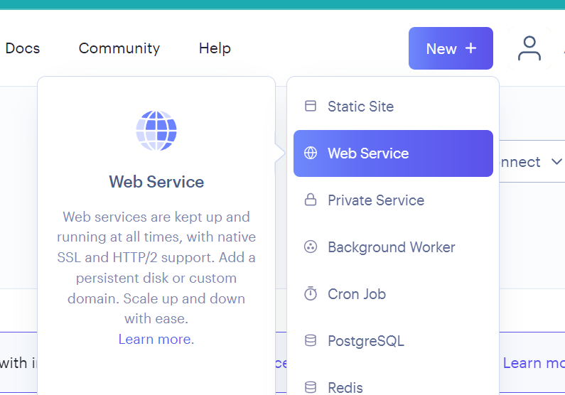
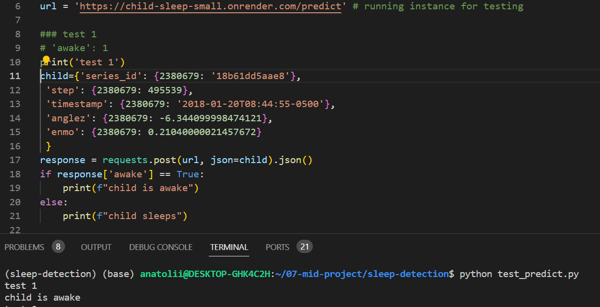

# DataTalks Midterm project
### Child Mind Institute - Detect Sleep States
### Overview

This midterm project is a part of the [Machine Learning Zoomcamp course](https://github.com/DataTalksClub/machine-learning-zoomcamp) held by [DataTalks.Club](https://datatalks.club/).

This project covers basic areas of machine learning and building web services.

### The Plan
- Data exploration (EDA), 
- Training of a Classification model 
- Reproducibility(exporting notebook to the script)
- Model deployment as a flask web service
- Containerization with docker
- Cloud deployment ([render.com](render.com))


### Problem description

The goal of this project is to detect sleep onset and wake. The model will be  trained on wrist-worn accelerometer data in order to determine a person's sleep state.  This work could make it possible for researchers to conduct more reliable, larger-scale sleep studies across a range of populations and contexts. The results of such studies could provide even more information about sleep.

The successful outcome of this research can also have significant implications for children and youth, especially those with mood and behavior difficulties. Sleep is crucial in regulating mood, emotions, and behavior in individuals of all ages, particularly children. By accurately detecting periods of sleep and wakefulness from wrist-worn accelerometer data, researchers can gain a deeper understanding of sleep patterns and better understand disturbances in children.

### Acknowledgments
The data used for this competition was provided by the [Kaggle competition: Child Mind Institute - Detect Sleep States](https://www.kaggle.com/competitions/child-mind-institute-detect-sleep-states)
#### Notes and challanges:
One of the most important parts of the problem is size and structure of the input data. It contained in two files.The merged result file will contains 127,946,340 row events, 4,9GB RAM memory 👀).Target transformation and label preparation also must be provided for scoring (read more [here](https://www.kaggle.com/code/carlmcbrideellis/zzzs-playing-with-the-competition-metric), and [here](https://www.kaggle.com/code/zulqarnainali/explained-baseline-solution?scriptVersionId=144284570&cellId=13))
Hence, as it is the mid term project for studying purposes I will use reduced [starter dataset](https://www.kaggle.com/datasets/carlmcbrideellis/zzzs-lightweight-training-dataset-target)(194MB) for more convinient and understandable process. Nevertherless, it is great starting point to work.


### Dataset


37 series_id
 Target is to  awake 0 or 1 where 1 means the that person is in awake state 
 


**series_id** - Unique identifier for each accelerometer series.
**step** - An integer timestep for each observation within a series.

**timestamp** - A corresponding datetime with ISO 8601 format %Y-%m-%dT%H:%M:%S%z.

**anglez** - As calculated and described by the GGIR package, z-angle is a metric derived from individual accelerometer components that is commonly used in sleep detection, and refers to the angle of the arm relative to the vertical axis of the body

**enmo** - As calculated and described by the GGIR package, ENMO is the Euclidean Norm Minus One of all accelerometer signals, with negative values rounded to zero. While no standard measure of acceleration exists in this space, this is one of the several commonly computed features


## Setup

All of the following instructions apply to WSL

The project can be used in two ways:
- development - if you want to reproduce all exploration steps (EDA, feature selection, etc...)
- production - if you want to use it as a service.

Prerequisites
 - Python 3.10.13 or above
 - Pipenv
 - Docker (in case you want to run service as a Docker container)

### Set up local environment

To install this project locally, follow the steps below:
 - Create a new folder and navigate to it.
 
 - Clone the project repository  
     ```
    git clone https://github.com/nogromi/mlzoomcamp-midterm-child-sleep
    ```
 - Create the new virtual environment:  
   for development (this will install both development and production dependencies)
     ```
    pipenv install --dev
    ```
   for production (this will install production dependencies only)
     ```
    pipenv install --ignore-pipfile
    ```
  - Download the [dataset](https://www.kaggle.com/datasets/carlmcbrideellis/zzzs-lightweight-training-dataset-target/download?datasetVersionNumber=4) and put it into `./data` folder. It should have a name`./data/archive.zip.` unzip it. We wll use `Zzzs_train.parquet` only
 - Activate virtual environment
      ```
    pipenv shell
    ```


That's all! Now you can easily run the scripts and notebooks.

## Usage

### Data processing, EDA, models (development environment only)

Run `./noteboks/notebook.ipynb`

### Training the model (development environment only)

The model can be retrained. Run the training script
```
python train.py
```
Script retrain the model with the dataset and saves the model as Python object into root  directory `./xgb_classifier.bin`

### Local service
To run the service locally, do the following:
 - Navigate to the project directory.
 - Start virtual environment
    ```
    pipenv shell
    ```
 - Run the service locally
    ```
    python predict.py
    ```

The  flask service should start on port 9696.  

You can test the service with this command in new terminal

    ```
    python test_predict.py
    ```
    

## Containerization
Alternatively you can run service as a Docker container. 
To build an image and run a container on your local machine do the following:
 - Navigate to the project directory.
 - Build docker image
    ```
    docker build -t child-sleep .

    ```
 - run a Docker container with your app
    ```
    docker run -it --rm -p 9696:9696 child-sleep
    ```
Instead of building an image by yourself, you can pull it out an already built from Dockerhub. Use the command 
```
docker pull nogromi/child-sleep-small
```


## Cloud deployment 
We will use [Render](https://render.com) for cloud deployment.

Do the following:  
1. log in to Render
2. Create a web service  
3. Select "Deploy an existing image from a registry" 
4. paste image to your image url
5. name the service
6 replace url  to your own url in `test_predict.py`
6. try to send the request using 

```
python test_predict.py
```

## Production service
There is a working service deployed on the [Render](https://render.com)
You can already test it by running `test_predict.py`` 
The script sends a request to the service and prints the response to the console.
a screenshot of using
